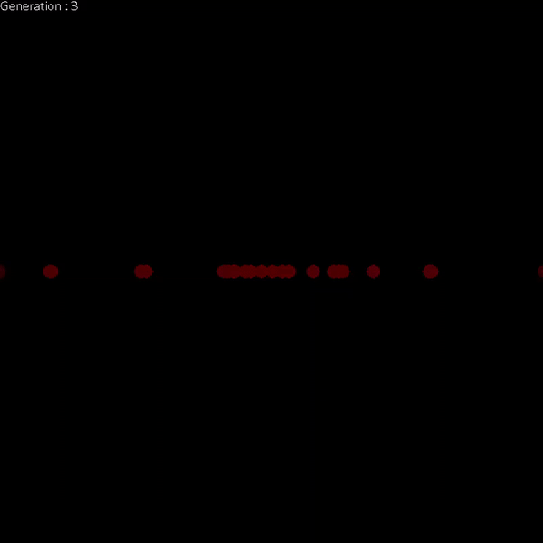
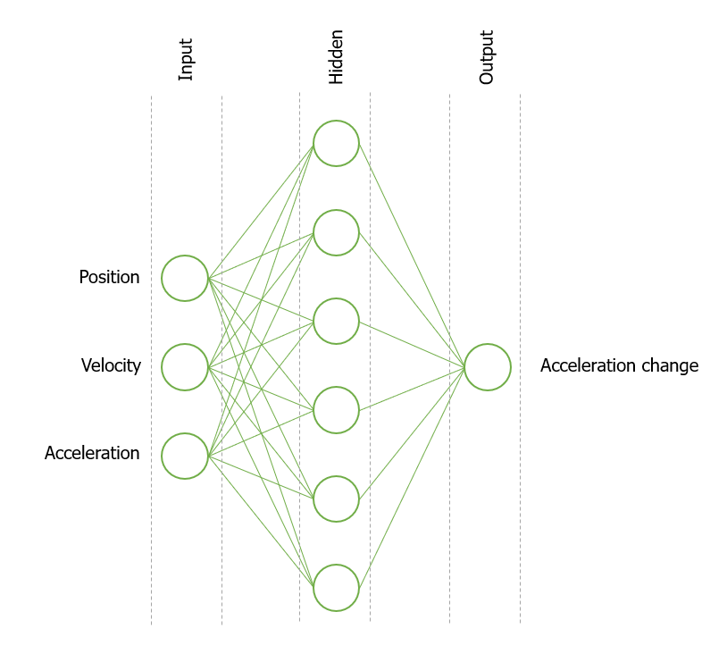
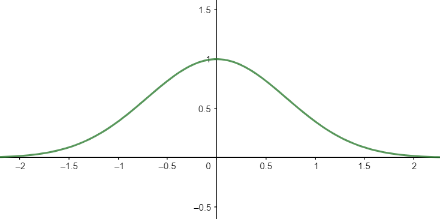

Author: Max Martinez Ruts
Note: This file contains a description of an experiment of the use of neuroevolution. The complete report together with the results of the experiments can be found in [report](neuroevolution.pdf).

See full animation showing the neuroevolution process during 15 generations: https://www.youtube.com/watch?v=u7ZbhkiOcdY

# Abstract
Neuroevolution techniques have been successfully applied in many reinforcement learning tasks. This
study aims at determining whether a neuroevolution method can be used to determine a stable tripleintegrator artificial vehicle controller system with the presence of a disturbing force. Control vehicles
involving more than one integration layer are known for being very unstable and difficult to control in
the presence of disturbance. Therefore a need to generate an artificial controller is originated. This study
contains a description of the experiment conducted, followed by an explanation of how genetic algorithms
and artificial neural networks are implemented to construct neuroevolution methods. Subsequently, the
product of the experiment is discussed by analyzing the results and different experiments are executed
using various parameters to analyze the effectiveness of crossover and mutation.

# Introduction 
Optimizing neural networks with genetic algorithms has proven to be a compelling approach to many control
tasks such as computer game playing or robot control. In such scenarios, a policy needs to
be learned to determine which actions are taken by the controller. The need to use neuroevolution originates
in the nature of the given scenario. The aim of this study is to achieve stability. However, stability cannot
be instantly accomplished by a single action, but it rather depends on a sequence of actions. Meaning that
a single action cannot be evaluated to be good or bad, but rather a combination of actions. These scenarios
are possible to solve using reinforcement learning, a technique that consists of evaluating the effectiveness
of a sequence of actions instead of singular action and awarding the solutions having greater effectiveness.
Neuroevolution then becomes a very suitable approach to achieve the aim of this study, as it is very efficient
and promising method to deal with reinforcement learning scenarios.

At this point a question can arise to determine whether a neuroevolution method can be used to achieve
a stable triple-integrator vehicle control system with the presence of a disturbing force. To answer this, a
study is performed employing a neuroevolution method to the scenario imposed.
By conducting an experiment where a population of artificial vehicle controllers are evolved using neuroevolution, an analysis of the results will be drawn and it be demonstrated that neuroevolution produces
promising results, by successfully achieving a population with most of the vehicles being stable after 50
generations. Moreover, the effects crossover and mutation rate will be tested to analyze their influence on
the evolution process to draw conclusions for obtaining faster and more stable results.

# Experiment Description 
The experiment consists of using neuroevolution method to evolve a population composed of vehicle
controllers. The control system of the vehicles is determined by an artificial neural network, which takes
position p, velocity v and acceleration a as inputs, and outputs a predicted jerk input change j. The jerk
input results in a change in acceleration da, at which is appended a disturbance acceleration signal at each
time step to hinder the process of the jerk prediction. The following block of code pictures the vehicle control.

time ← 0 
acc ← 0 
vel ← 0 
pos ← 0 

while time < simulation time do 
...jerk ← Predict(pos, vel, acc) 
...acc ← acc + jerk 
...acc ← acc + random uniform(−max disturbance, max disturbance) 
...vel ← vel + acc 
...pos ← pos + vel 
...time ← time + 1 
end while 

# Vehicle control types
## Position control
Position control is the plainest type of vehicle control. A prevalent example of such is the controlling of a
pointer on a computer screen with a mouse or trackpad. Nevertheless, position control is hardly applied or
achieved in vehicles, with velocity and acceleration controls being more widespread.

## Velocity control
Velocity control is the most frequent type of control in vehicles. It can be found in a range of different types
of vehicles such as cars, and large aircraft. To control such vehicles the pilot intends to regulate the velocity
of the vehicle. Thereby, the position of the vehicle is the integrated input of the control system (velocity),
and acceleration is its time derivative.

## Acceleration control
In general, acceleration control is the hardest task a pilot will have to perform. However, it is also the
most common in nature due to its parallelism to force. The most common vehicle type that is based on
acceleration control is a helicopter and large aircraft, which usually operates as a double integrator system.
By varying the acceleration, the velocity of the vehicle position is, therefore, the integral of the acceleration
input and the position is its second integral.

## Jerk control
Jerk is defined as the time derivative of acceleration. Its physical meaning is a very complex concept to
understand for humans, as our vestibular system only provides us with a sense of acceleration. As one can
imagine, these systems are extremely difficult to be controlled by humans. Yet, this type of control is present
in some vehicles. Surface controls in aircraft, for instance, lead to small acceleration changes, meaning that
the control of the surface is actually an input of the aircraft jerk. As the position or even velocity stability
for these systems is extremely difficult, they are to be controlled artificially.

The scenario offered in this study is the jerk control of a vehicle.

# Neuroevolution
Neuroevolution is the application of genetic algorithms to optimize weights and biases in a fixed topology
neural network. Artificial neural networks (ANNs) are usually optimized using gradient techniques with
backpropagation. Neuroevolution, alternatively, considers the use of genetic algorithms to optimize neural
networks by using a reinforcement system where multiple ANNs are evaluated under a fitness score. ANNs
with superior scores are reproduced more often, creating a tendency on the set of ANNs to evolve towards
superior and thereby optimal ANNs.

# Artificial Neural Networks
An Artificial Neural Network (ANN) is a computing system inspired by biological neural networks. Its
structure is formed by connected nodes. Nodes can be seen as of biological neurons and the connections can
be seen as of biological synapses, which can transmit and process signals from one node to another.
This model allows any information to be processed while traveling from one part of the ANN to another.
The information is to be processed by scaling and shifting the incoming value by the use of weights and
biases, and subsequently applying an activation transform to the resulting value in order to introduce nonlinearities to the system. Thereby, the only values that determine how the information is to be processed
are the weights and biases, which ultimately determine the behavior of the ANN.

Commonly, ANNs are structured in layers. Layered structures organize the nodes in different layers.
By doing so, connections can only be present from nodes of one layer to nodes of subsequent layers, which
causes the information to travel in an acyclic, unidirectional manner; from the input layer to the output layer.
The complexity of ANN goes beyond the scope of this study. From now on, therefore, an ANN will be
treated as a processing function; a function processing an input to obtain an output. Treating an ANN as
such is useful to envision what is the actual role of an ANN in this study. ANNs are used for building a
function that can process the current information of the vehicle control to return an action as a response.

## Neural Network Topology
The topology of an ANN reefer to its structural organization of nodes and connections. Topology of ANNs
can contribute to their performance. Having described the scenario in Experiment Description section, the input and output layers can already be determined. The input layer consists of three nodes - position p, velocity v and acceleration a - values. The output layer
consists of one node containing the information on the increase in acceleration da. An extra hidden layer
consisting of 6 nodes is also present to and depth - and therefore complexity - to the neural network. In
order to account for non-linearities within the input variables to predict the system’s behavior, the activation
function of the hidden and output layers are sigmoid functions, (used for probabilistic examples, as it outputs
values from 0 to 1). The outputs are then maped from [0,1] to [-0.5,0.5] to obtain an unbiased jerk input.
Figure 'Network Topology' displays the topology of the ANN to be used.

The neural network can, therefore, be seen as a function that inputs the position, velocity, and acceleration of the vehicle, and outputs a change in acceleration. Hence, the problem scenario consists of optimizing
ANN such that it can precisely determine da to achieve stability.
There are several methods to optimize an ANN depending on the behavior and the utility of the ANN.
The method used for this scenario is neuroevolution; a genetic algorithm approach to optimize reinforcement
learning ANNs. The optimization of the ANN will be delivered by using neuroevolution to change the weights and biases of the ANN. However, a more elaborated and complex behavior of an ANN could be achieved by
also altering the topology of the ANN. This method is referred to as NEAT (Neuroevolution of Augmented
Topologies).

  

Figure: Network Topology

# Genetic Algorithms
Genetic Algorithms (GAs) are inspired by Darwins theory of biological evolution. GAs differ from the
rest of optimization methods by the fact that a set of solutions is maintained rather than a singular one.
GAs are formed by a set of genetically diverse specimens, being evaluated under a certain fitness function.
Each specimen inherits a likelihood of survival, proportional to its evaluated fitness score. This behavior
is often referred to as survival of the fittest, the basic argument on which natural selection is based. This
behavior allows species to evolve, as specimens which survive longer are also the ones with more chances
to reproduce similar copies of themselves, thereby inducing a tendency on the population of subsequent
generations towards fitter specimens.

GAs are proved to be very effective in many real world and engineering optimization tasks such as electromagnetic system design and aerodynamic design. The reason why it has become widely used and
effective is due to its simplistic implementation in object-oriented programming. A parallelism is present
between biological evolution and GAs, populations being sets, specimens being objects, genes being weights
and biases and brains being ANNs. One could think of this parallelism by comparing the biological approach:

”Natural selection invokes a tendency on succeeding generations to produce populations with specimens
having smarter brains as a consequence of the evolution of their DNA. Such improvement leads to a general
rise on their performance”

With the programmatic approach:

”Genetic algorithms invokes a tendency on succeeding generations to produce sets with objects having
optimal neural networks as a consequence of the evolution of their weights and biases. Such improvement
leads to a general rise in their fitness score.”

## Selection
Selection is the determination process to decide which specimens will leave a successor on the next generation and which specimens will disappear without a successor. GAs use a different variety of selection
methods. Most of them, however, have a peculiarity in common; they tend to select fit specimens, based on
the behavior known as survival of the fittest.

### Fitness Score determination
To determine the selection process, a fitness score has to be awarded to each specimen in the population. In
the scenario proposed, a fitness score will be proportional to the stability achieved by the vehicle (specimen).
There exist several methods to evaluate the stability of a vehicle. The method used consists on running a
simulation of the vehicles, departing from the center of the screen and appending a score at each time step
that is higher the closest the vehicle is from the center of the screen, meaning that vehicles remaining close
to the center of the screen during the simulation (hence achieving stability) will receive a higher fitness score.
The exact award given at each time step is determined using a Gaussian function:

d_score = e−(pos−center)*2

This ensures that only vehicles close to the center of the screen will be awarded a significant fitness score (see Gaussian Function Figure)

  

Figure: Gaussian Function

The following code provides a programmatic approach picturing how the fitness score is determined by
executing a simulation. As stated in the experiment description, at each time step an extra acceleration
term is randomly introduced to difficult the prediction task.

function evaluate fitness(specimen) 
.....score ← 0 
.....time ← 0 
.....acc ← 0 
.....vel ← 0 
.....pos ← 0 
.....while time < simulation time do 
..........jerk ← Predict(pos, vel, acc, specimen.genotype) 
..........acc ← acc + jerk 
..........acc ← acc + random uniform(−max disturbance, max disturbance) 
..........vel ← vel + acc 
..........pos ← pos + vel 
..........score ← score + e−(pos−center) 
..........time ← time + 1 
.....end while 
.....return score 
end function 

## Selection method used
The selection method used for this specific scenario is based on the principle of survival of the fittest. The
population size is set constant to N throughout all generations. After all specimens of the population are
evaluated under their fitness scores, an algorithm is applied to decide which of the specimens will partake
in the reproduction process. This algorithm assigns a probability of reproduction equivalent to its fitness
score, therefore leaving fitter specimens with higher chances to take part in the reproduction process.
The following block of code illustrates how a progenitor for a newly generated specimen is selected.
Note that the method only works under the condition that the total score generated by all the population
is equal to 0. Therefore, the fitness scores have to be previously normalized such that the sum of all scores is 1:

function pick parent 
.....i ← 0 
.....r ← random(0, 1) 
.....while r > 0 do 
..........r ← r − evaluate fitness(specimens[i]) 
..........i ← i + 1 
.....end while 
.....i ← i − 1 
.....return specimens[i] 
end function 

## Reproduction
In nature, reproduction is the process of generating new specimens sharing similar genetic information to
the one of their progenitors. Multiple reproduction methods are present in nature, and all of them have a
particularity in common; they are designed to ensure diversity of a species. Genetic diversity is achieved
by DNA alternation, which can be developed by many different processes. Two of the most common are
crossover and mutation.

### Crossover
Crossover is the ability for some specimens to reproduce a hybridized genetic copy of themselves. Crossover
is, therefore, a feature that allows the species to diversify. Crossover is commonly thought as sexual reproduction, which involves the union of a male and a female specimen. Although nature mostly experiences sexual reproduction with two progenitors, a crossover method can be designed where multiple progenitors are involved in the contribution of genes to the successor. However, in the experiment driven, bi-parent reproduction is chosen. A programmatic approach to deal with crossover is to simply create a hybrid genotype
from the predecessors.

As genotypes are composed by the weights and biases of the ANN, which are arranged as matrices, a
hybrid genotype can be generated by simply creating a weighted average of the individual genotypes of each
progenitor. The following block of code pictures a programmatic approach to achieve crossover.

function crossover 
.....genotype1 ← pick parent 
.....genotype2 ← pick parent 
.....genotype ← (genotype1 + genotype2)/2 
.....return genotype 
end function 

As the genetic information needed to model the ANN is composed by four different genotypes (weights hidden,
biases hidden, weights output, biases output), the crossover method will be applied to each of these four
genotypes.

### Mutation
Mutation is the capability for a specimen of modifying its genotype, providing the population the ability to
diversify. Diversity is key-driving in GAs, as it allows a population to have a broad genotype domain, which
expands the search domain, thereby increasing the possibilities from emerging new species with a unique set
of genes that drive speciments to increase their performance.

If diversification was nonexistent, a population would tend to converge to a single species. Certainly, it
would be the best species generated at the moment, but the new species would not tend to evolve, as all
individuals would tend to the fittest specimen in the population without the opportunity to generate specimens with distinct genotypes. It is therefore meaningful to define a parameter that represents the likelihood
for a gene of a specimen to be cloned from its progenitor. Such a parameter is referred to as mutation rate;
defined as the likelihood for a gene to be mutated.

If the mutation rate is set high, the population tends to diversify. However, the successors might not carry
enough genetic information from their progenitors, and thereby some of the genes that made the progenitor
a fit specimen could be lost. Similarly, if the mutation rate is set low, the progenitors will carry most of the
genetic information of theirs successors but this could lead to a poor tendency to evolve, as the diversity
of the species might be too low. Another relevant parameter is the mutation magnitude. When a gene of
the specimen is mutated, it can either be redefined as a random gene or as a variation of the original gene.
In the last case, a key parameter is the mutation magnitude; defined as the magnitude of how much is the
original gene varied.

The following block of code uses a random mutation magnitude, which can contribute to increasing the
diversity of the population, as it adds a random parameter to the method.

function mutation(genotypes, mutation rate) 
.....for all gene in genotype do 
..........r ← random(0, 1) 
..........if r < mutation rate then 
...............gene ← gene + random normal 
..........end if 
...end for 

# Backpropagation vs GAs for ANN optimization
In Neural-Network optimization, backpropagation is the most common approach. Backpropagation is a gradient search technique. Such technique is based on dtermining the optimal direction in the domain space
(weights and biases) such that the loss is minimized, by the use of the chain rule. The loss function is defined
as the distance between the output of the neural network and the desired output. To use backpropagation
it is, therefore, necessary to label the outpus, as the loss function is the distance from the labeled outputs
to the resulting outputs This limits the use of backpropagation to supervised learning, as it is not possible
to optimize the neural network if the solution (output) is not known in advance. Moreover, gradient descent
techniques guarantee the best solution in the region of the starting point. Obtaining a global solution is
therefore dependent on the choice of initial starting values.

GAs tend to produce global solutions (see [6]). Specimens in a global solution are fitter than specimens
in a local solution, thereby inducing a tendency on the population towards global solutions. Due to this
behavior, GAs typically outperform backpropagation for very non-linear problems as described in [4], as
gradient descent tends to produce local solutions due to the loss function being hilly among the search
space. In GAs, instead, if the population size is kept high and the diversity of the population is high enough
such that a broad space can be covered, a global solution is encountered. Another essential advantage
over backpropagation is that GAs can be used for unsupervised learning and reinforcement learning as described in [2], as it is not based on a loss function (dependent on the desired output) but on a fitness function
which is rather dependent on the performance achieved by processing the input (state) to an output (action).

The previous reasoning leaves GAs to be the best fit for the problem scenario, as the solution to the
problem requires reinforcement learning and that the domain space is rather non-linear. But why is the case
that this scenario requires reinforcement learning?

The proposed problem lies in a scenario where the neural network has as inputs (p,v and a) and output
(da). However, given the inputs, the best output cannot be directly determined, as it is difficult to determine
if the action will produce a good or a bad result in order to achieve stability. In other words, a loss function
cannot be determined. This is because an acceleration change will not produce a direct result in the stability
of the object. The stability will be rather achieved by a sequence of good acceleration changes. Therefore
singular acceleration change wont have a direct result on the stability of the object, but rather a chaotic
one. It is for this reason why an output cannot be directly compared to the desired output, precluding
the determination of a loss function and therefore precluding supervised learning. A similar situation is
encountered in chess. One can not train a supervised neural network by determining which is the best move
to do in a certain situation, as the effectuation of a move will not have an instant result on the game but
rather a chaotic one that will affect the result of the game in the future.

